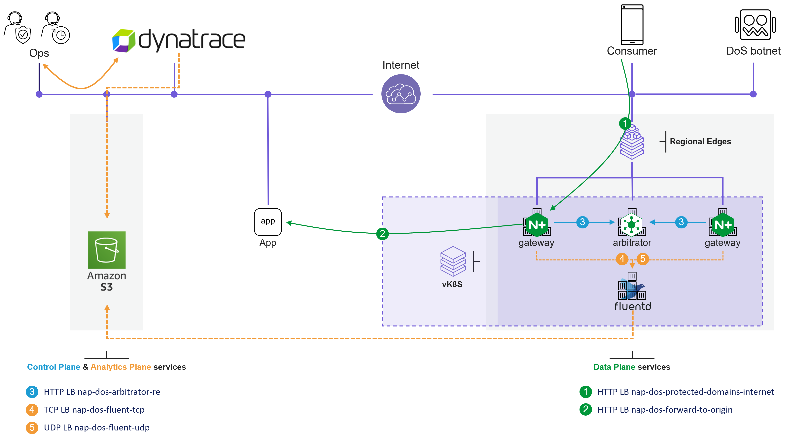

XC PaaS App Protect L7 DDoS
####################################################################

`NGINX App Protect DoS <https://docs.nginx.com/nginx-app-protect-dos/>`_ gateways
send `Security event <https://docs.nginx.com/nginx-app-protect-dos/monitoring/types-of-logs/#security-log>`_ logs
using TCP protocol. If you need more receivers or different output protocols,
`a Fluentd micro-service <https://docs.fluentd.org/>`_ will convert Security event logs to different
`outputs <https://docs.fluentd.org/output>`_, for example a `S3 bucket <https://docs.fluentd.org/output/s3>`_.

The diagram below shows an example of a S3 Bucket as a receiver and Dynatrace as a log consumer
to create visibility and alerting to Ops teams.

.. contents:: Contents
    :local:

AWS
*****************************************

S3 Bucket
=========================================
Create a private S3 bucket with a Bucket policy that allows access from
`F5 XC IP addresses of your region <https://docs.cloud.f5.com/docs/reference/network-cloud-ref>`_
and for an authenticated service principal. See below an example that allow all authenticated user of your corporation
and from some F5 XC IPs.

.. code-block:: json

        {
            "Version": "2012-10-17",
            "Statement": [
                {
                    "Effect": "Allow",
                    "Principal": {
                        "AWS": "*"
                    },
                    "Action": "s3:ListBucket",
                    "Resource": "arn:aws:s3:::alexis-nap-dos-sec-event-2",
                    "Condition": {
                        "IpAddress": {
                            "aws:SourceIp": [
                                "84.54.60.0/25",
                                "5.182.212.0/22"
                            ]
                        }
                    }
                },
                {
                    "Effect": "Allow",
                    "Principal": {
                        "AWS": "*"
                    },
                    "Action": [
                        "s3:PutObject",
                        "s3:GetObject"
                    ],
                    "Resource": "arn:aws:s3:::alexis-nap-dos-sec-event-2/*",
                    "Condition": {
                        "IpAddress": {
                            "aws:SourceIp": [
                                "84.54.60.0/25",
                                "5.182.212.0/22"
                            ]
                        }
                    }
                }
            ]
        }

XC
*****************************************

1) BUILD image
=========================================

.. code-block:: bash

    git clone https://github.com/nergalex/docker-nap-dos.git
    cd docker-nap-dos/fluentd/
    DOCKER_BUILDKIT=1 docker build --tag fluentd:s3 --no-cache .

2) PUSH to your private Container Registry
=========================================

.. code-block:: bash

    docker tag fluentd:s3 my-acr.azurecr.io/fluent/fluentd:s3
    docker login my-acr.azurecr.io
    docker push my-acr.azurecr.io/fluent/fluentd:s3

3) DEPLOY as a workload on your XC vK8S
=========================================
- Copy-Paste the JSON `here <https://github.com/nergalex/docker-nap-dos/tree/master/fluentd/_xc-objects/workload.json>`_
as new workload object.
- Modify the **tenant** name et the **private container registry name**
- Modify the **fluent** configuration as required. An example for a S3 bucket:

.. code-block:: xml

        <match nap-dos-sec-event>
          @type s3
          aws_key_id MY-KEY
          aws_sec_key MY-SECRET-KEY
          s3_bucket my-bucket-name
          s3_region my-bucket-region
          path logs/
          time_slice_format %Y%m%d-%H-%M-%S
          s3_object_key_format %{path}%{time_slice}.%{file_extension}
          store_as json
          overwrite true
          <buffer tag,time>
            @type file
            path /var/log/fluent/s3
            timekey 10 # partition
            timekey_wait 1m
            timekey_use_utc true
            chunk_limit_size 256m
          </buffer>
        </match>
        <source>
          tag nap-dos-sec-event
          @type tcp
          port 5261
          <parse>
            @type none
          </parse>
        </source>

TROUBLESHOOT
*****************************************

Receive messages from NAP DOS gateways
=========================================
- A **fluent** configuration to show received messages on the POD logs:

.. code-block:: xml

        <match nap-dos-sec-event>
          @type stdout
          @id output_stdout
        </match>
        <source>
          tag nap-dos-sec-event
          @type tcp
          port 5261
          <parse>
            @type none
          </parse>
        </source>

Access to S3 bucket
=========================================
- Upload a ``test.txt`` a file on your bucket
- The output of the command line below will return a 200 http code if the access is OK

.. code-block:: bash

        export KEY_ID="XXX"
        export SEC_KEY="XXX"
        export SESS_TOKEN="XXX" # empty value if it is a service pricinpal account
        bash ./get-object-s3.sh my-bucket-name test.txt
